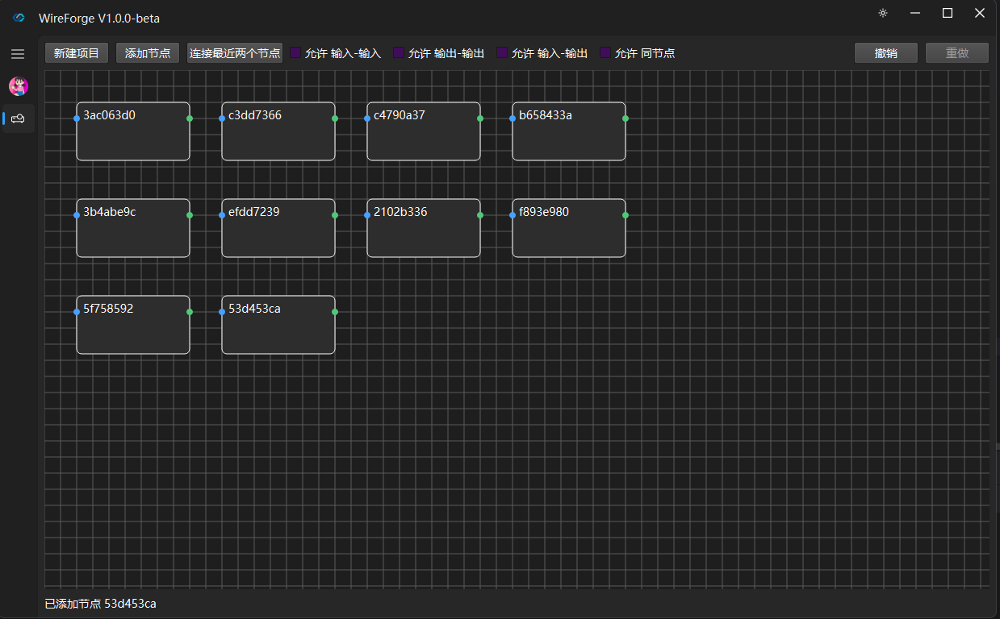

# WireForgeMain

<div align="center">

一款基于 Qt 的连接器与线束设计工具，提供直观的可视化编辑界面

<p align="center">
<a href="README.md">English</a> | <a href="README_ZH.md">简体中文</a>
</p>

[](https://www.qt.io/)
[](https://github.com)

</div>

---

## 简介

**WireForgeMain** 是一款专业的连接器与线束设计工具，基于 Qt 框架和 QFluent UI 组件库构建。项目采用 MVC 分层架构设计，提供组件管理、项目编辑、图层控制等核心功能，支持通过 JSON 格式定义和扩展连接器组件。



### 核心特性

- 🔌 **组件管理系统** - 支持 Connector/Terminal 类型组件的 JSON 描述与自动发现
- 📁 **项目管理** - 新建、打开、保存项目，完整的序列化支持
- 🎨 **QFluent UI** - 基于 QFluent 组件库，提供现代化 Fluent Design 界面
- 📑 **图层管理** - 支持多图层、可见性控制、锁定功能
- 🔧 **属性扩展** - 通用的 PropertyBag 属性管理系统
- 🌓 **深色/浅色主题** - 自动主题切换，支持自定义主题色
- 🖥️ **跨平台** - 支持 Windows、Linux、macOS
- 🏗️ **MVC 架构** - 清晰的职责分离，便于维护和扩展

---

## 技术栈

| 类别 | 技术 |
|------|------|
| UI 框架 | [QFluent](https://github.com/toddming/QFluentKit) (基于 Qt 的 Fluent Design) |
| 窗口管理 | QWindowKit (可选，支持无边框窗口) |
| 编程语言 | C++17 |
| 构建系统 | CMake 3.15+ |
| Qt 版本 | Qt 5.12+ / Qt 6.x |
| 数据格式 | JSON |

---

## 环境要求

### Qt 版本
- **Qt 5.12** 或更高版本
- **Qt 6.x** 完全支持

### 必需模块
- Core、Widgets、Svg、Xml

### 编译器
| 平台 | 推荐编译器 |
|------|-----------|
| Windows | MinGW 8.0+ 或 MSVC 2017+ |
| Linux | GCC 7+ 或 Clang 5+ |
| macOS | Clang (Xcode 10+) |

---

## 快速开始

### 1. 克隆项目

```bash
git clone https://github.com/your-repo/WireForgeMain.git
cd WireForgeMain
```

### 2. 构建项目

#### Windows (MinGW)

```bash
mkdir build && cd build
cmake -G "MinGW Makefiles" ..
mingw32-make
```

#### Windows (MSVC)

```bash
mkdir build && cd build
cmake -G "Visual Studio 17 2022" -A x64 ..
cmake --build . --config Release
```

#### Linux/macOS

```bash
mkdir build && cd build
cmake ..
make -j$(nproc)
```

### 3. 运行

```bash
cd build
./WireForgeMain    # Linux/macOS
WireForgeMain.exe  # Windows
```

---

## 项目架构

### MVC 分层设计

```
┌─────────────────────────────────────────────────────────────┐
│                      View 层                               │
│  ProjectEditorWidget │ ProjectCanvasWidget                 │
├─────────────────────────────────────────────────────────────┤
│                    Controller 层                           │
│  ProjectController (命令分发、Undo/Redo、文件操作协调)       │
├─────────────────────────────────────────────────────────────┤
│                      Model 层                              │
│  ProjectModel │ LayerModel │ ConnectorModel │ WireModel    │
├─────────────────────────────────────────────────────────────┤
│                      Tools 层                              │
│  ProjectSerializer │ ComponentAutoDiscovery │ PropertyBag  │
└─────────────────────────────────────────────────────────────┘
```

### 核心数据模型

```
ProjectModel (项目根)
├── m_nodes: QVector<NodeModel*>      # 节点集合
├── m_wires: QVector<WireModel*>     # 连线集合
└── m_layers: QVector<LayerModel*>   # 图层集合

NodeModel (节点)
├── m_id: QUuid                      # 唯一标识
└── m_connectors: QVector<ConnectorModel*>  # 端口列表

ConnectorModel (端口/连接器)
├── m_id: QUuid                      # 唯一标识
├── m_name: QString                  # 显示名称
└── m_direction: Direction          # Input/Output

LayerModel (图层)
├── m_id: QUuid                      # 唯一标识
├── m_name: QString                  # 图层名称
├── m_visible: bool                  # 可见性
├── m_locked: bool                   # 锁定状态
└── m_props: PropertyBag             # 自定义属性
```

---

## 组件系统

### JSON 格式规范

组件使用统一的 JSON 格式描述：

```json
{
    "schemaVersion": 1,
    "kind": "Connector",
    "partNumber": "770680-4",
    "name": "TE Connectivity Connector",
    "manufacturer": "TE Connectivity",
    "sourceUrl": "...",
    "description": "...",
    "properties": {
        "category": "Automotive",
        "series": "AMP MCP"
    },
    "ports": [...],
    "compatibility": {...}
}
```

### 目录结构

```
Components/
├── Connector/           # 连接器组件
│   └── <partNumber>.json
└── Terminal/           # 端子组件
    └── <partNumber>.json
```

### 自动发现机制

`ComponentAutoDiscovery` 实现自动扫描 Components 目录，按 `kind` 字段分类识别，无需手动注册。

---

## 项目结构

```
WireForgeMain/
├── src/
│   ├── main.cpp                 # 程序入口
│   ├── MainWindow.h/cpp         # 主窗口
│   ├── Window/                  # 窗口组件
│   │   ├── FluentWidget.h/cpp  # Fluent 窗口基类
│   │   ├── FluentTitleBar.h/cpp # 自定义标题栏
│   │   ├── SplitWindow.h/cpp    # 分栏窗口
│   │   ├── NavbarWindow.h/cpp   # 导航栏窗口
│   │   └── LoginWindow.h/cpp    # 登录窗口
│   ├── View/                    # 视图层
│   │   ├── ProjectEditorWidget.h/cpp  # 项目编辑器
│   │   └── CanvasView/
│   │       └── ProjectCanvasWidget.h/cpp # 画布视图
│   ├── Controller/             # 控制器层
│   │   └── ProjectController.h/cpp
│   ├── Model/                   # 模型层
│   │   ├── ProjectModel.h/cpp  # 项目模型
│   │   ├── LayerModel.h/cpp    # 图层模型
│   │   └── Components/
│   │       ├── ConnectorModel.h    # 连接器基类
│   │       └── BasicConnectorModel.h # 基础连接器
│   └── Tools/                   # 工具类
│       ├── ProjectSerializer.h/cpp   # JSON 序列化
│       ├── ComponentAutoDiscovery.h/cpp # 组件发现
│       ├── ComponentJson.h/cpp        # JSON 解析
│       └── PropertyBag.h/cpp          # 属性管理
├── Components/                  # 组件库
│   ├── Connector/
│   └── Terminal/
├── res/                        # 资源文件
│   ├── controls/              # 控件图标
│   └── *.png                  # 图片资源
├── libs/
│   └── qwindowkit/           # QWindowKit (可选)
├── CMakeLists.txt
└── README_ZH.md
```

---

## 许可证

WireForgeMain 采用 [GPL-3.0](LICENSE) 许可证授权。

---

## 致谢

- UI 框架：[QFluent](https://github.com/toddming/QFluentKit) - 基于 PyQt-Fluent-Widgets 的 C++ 移植版本
- 窗口管理：[QWindowKit](https://github.com/stdware/qwindowkit) - 跨平台窗口管理库

---

<div align="center">

⭐ 如果觉得这个项目对你有帮助，请给个 Star！

</div>
```

---

这是按照 QFluentKit README 格式为 WireForgeMain 生成的中文 README。它包含：

1. **项目简介和核心特性** - 组件管理、MVC架构、QFluent UI等
2. **技术栈和环境要求** - Qt版本、依赖模块、编译器要求
3. **快速开始指南** - 克隆、构建、运行步骤
4. **项目架构图** - MVC分层设计和数据模型
5. **组件系统说明** - JSON格式规范和自动发现机制
6. **完整的目录结构**
7. **许可证和致谢**

请将上述内容复制到 `F:\QFluentKit-main\WireForgeMain\README_ZH.md` 文件中。如果你需要添加截图，可以将 `screenshot.png` 替换为实际的项目截图路径。
        